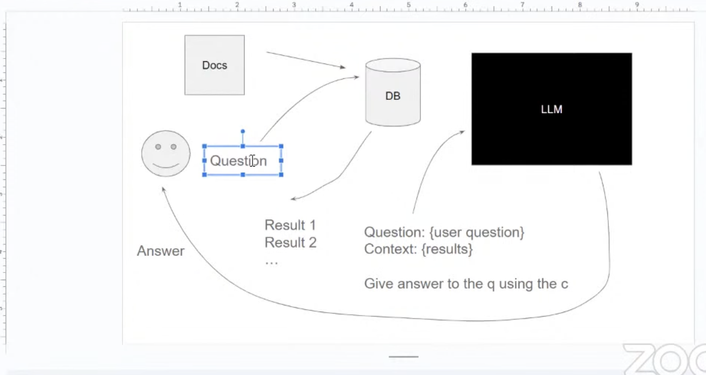
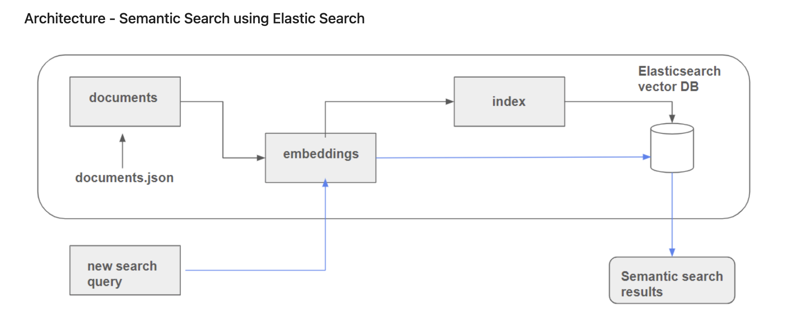
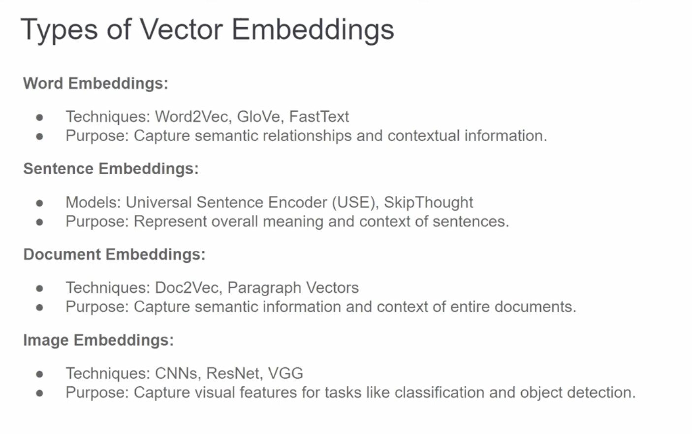

# [LLM ZoomCamp](https://github.com/DataTalksClub/llm-zoomcamp/)

[2024 edition youtube playlist](https://www.youtube.com/playlist?list=PL3MmuxUbc_hKiIVNf7DeEt_tGjypOYtKV)

# Simple RAG with Open AI

- Jupyter notebook: [elastic RAG](elastic-rag.ipynb)

Resources:

- ZoomCamp [workshop](https://www.youtube.com/watch?v=q-p36Ak6YI8&list=PL3MmuxUbc_hKiIVNf7DeEt_tGjypOYtKV&index=2)
- step by step guide in [this repo](https://github.com/alexeygrigorev/llm-rag-workshop)

Notes:

- I developed this locally with some small changes to the tooling (for example using poetry to manage my dependecies and adding linting and isort to pre-commit etc to follow some best practices)

Design sketch:

Check this for real world implementation: https://github.com/aaalexlit/faq-slack-bot

# To Do

[ ] Cache the responses

---

# Adding semantic search

- jupyter notebook: [semantic_search](semantic_search.ipynb)

- Resources: [vector search tutorial](https://github.com/DataTalksClub/llm-zoomcamp/tree/main/03-vector-search)

Notes:

- install [sentence_transformers](https://sbert.net/). With this we can call [pre-trained models available](https://sbert.net/docs/sentence_transformer/pretrained_models.html) and create embeddings (with `model.encode`); the length of encoding aka `dims` will differ from model to model
- choose what fields you want to encode - in the case of our documents it would make sense to encode the 'text' field
- setup Elastic Search and create mappings and indexes that will also contain the encoded field
- the search term also needs to be vector encoded so run `model.encode(search_term)` on it before constructing the query
