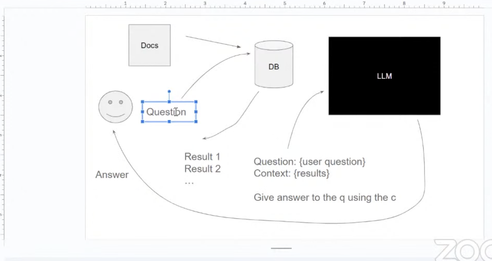

# LLM-ZoomCamp-Intro

Following this ZoomCamp [workshop](https://www.youtube.com/watch?v=q-p36Ak6YI8&list=PL3MmuxUbc_hKiIVNf7DeEt_tGjypOYtKV&index=2)
More info and step by step guide in [this repo](https://github.com/alexeygrigorev/llm-rag-workshop)
Instead of using codespaces I developed this locally with some small changes to the tooling (like using poetry to manage my dependecies and adding linting and isort to pre-commit etc to follow some best practices)

Design sketch:

